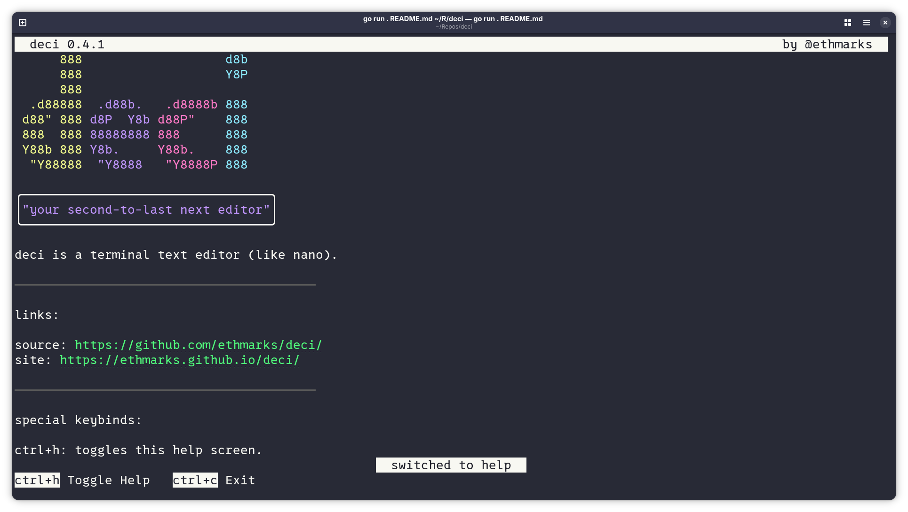

# deci

`deci` is a terminal text editor like `nano`. My first project in
[Go](https://go.dev) using
[Bubble Tea](https://github.com/charmbracelet/bubbletea) and the
[Charm ecosystem](https://github.com/charmbracelet).



## Quickstart

**Install `deci` by downloading the pre-built binary for your platform from the
[releases page](https://github.com/ethmarks/deci/releases).** If you have Go
installed, you can also [build from source](#building-from-source) using this
command:

```sh
go install github.com/ethmarks/deci@latest
```

Once you have `deci` installed, you can run it in your terminal using the `deci`
command followed by the filepath you want to edit (if it doesn't exist, `deci`
will create it when you save). You can also run `deci` without a filepath if you
want, and it'll default to `deci_out.txt`.

```sh
deci myfile.txt
```

Once you have `deci` opened, you can just edit your file like in a normal text
editor. A list of available keybinds is displayed at the bottom of the screen,
and you can press `ctrl+h` to open the help screen. Press `ctrl+o` to save your
file.

## Features

- Integrated Markdown previewing with
  [Glamour](https://github.com/charmbracelet/glamour)
- Undo/redo buffer
- Cursor movement modeled on Zed and VS Code
- TUI components styled with
  [Lipgloss](https://github.com/charmbracelet/lipgloss)
- Customizable cursor shape and preview theme

## Keybinds

`deci` has unique behavior for 112 keybinds in total.

Basic keybinds that every editor has but which still required a _lot_ of code to
implement:

- Typeable characters like "a" and "1" (94 in total): inserts the character at
  the cursor and moves the cursor right
- `enter`: splits the current line and moves the right half to a new line (which
  has the effect of creating a new line if the cursor is at the end of a line)
  and moves the cursor to the start of the next line.
- `backspace`: if the cursor is _not_ at the start of a line, removes the
  character to the left of the cursor and moves the cursor left. If it _is_ at
  the start of a line, it merges the current line with the previous line (which
  has the effect of removing it if the current line is blank) and moves the
  cursor up and to the end of the line
- `delete`: if the cursor is _not_ at the end of a line, removes the character
  to the right of the cursor. If the cursor _is_ at the end of a line, it merges
  the next line with the current line
- `tab`: inserts 4 spaces
- `ctrl+z`: reverts to the previous editor state
- `ctrl+y`: does the opposite of `ctrl+z`

Cursor movement keybinds, which every editor supports, but were so complicated
that they get their own category:

_I modeled these behaviors by observing how the IDE that I use (Zed) handles
cursor movement. I've also done some testing in VS Code, and it behaves the same
as far as I can tell._

- `up`: if the cursor is _not_ on the first line, moves the cursor up one line
  and either to the end of the current line or the last x position, whichever is
  smaller. If the cursor _is_ on the first line, moves the cursor to the start
  of the line
- `down`: if the cursor is _not_ on the last line, moves the cursor down one
  line and either to the end of the current line or the last x position,
  whichever is smaller. If the cursor _is_ on the last line, moves the cursor to
  the end of the line
- `left`: if the cursor is _not_ at the start of the line, moves the cursor
  left. If the cursor _is_ at the start of the line, moves the cursor up and to
  the end of the previous line
- `right`: if the cursor is _not_ at the end of the line, moves the cursor
  right. If the cursor _is_ at the end of the line, moves the cursor down and to
  the start of the line
- `ctrl+left`: moves left until either it reaches the start of the line or it
  reaches a character that _isn't_ a delimiter (like a space or a punctuation
  mark), then continues moving left until it reaches a character that _is_ a
  delimiter
- `ctrl+right`: moves right until either it reaches the end of the line or it
  reaches a delimiter, then continues moving right until it reaches a character
  that _isn't_ a delimiter

Special keybinds:

- `ctrl+c`: closes `deci` without saving
- `ctrl+o`: writes the editor content out to a file
- `ctrl+h`: toggles the help screen
- `ctrl+p`: toggles the Markdown preview screen
- `alt+p`: changes the Markdown preview theme
- `alt+c`: changes the cursor shape

## How it Works

`deci` uses the [Bubble Tea](https://github.com/charmbracelet/bubbletea)
framework, so it adopts inherits
[The Elm Architecture](https://guide.elm-lang.org/architecture/), which means
that the code is split into three distinct sections:

- [Model](#model), which stores the _entire_ state of the editor
- [View](#view), which inputs 1 model and outputs 1 fully rendered terminal
  screen
- [Update](#update), which modifies the model based on events (like keypresses)

### Model

The model ([model.go](./model.go)) stores the following stuff:

- editor lines
- lines to display (this is usually set as a pointer to the editor lines, but
  it's swapped out for the help lines or the preview lines when those screens
  are active)
- filename to write out to
- status message
- error message, if there is one
- active screen (editor, help, or preview)
- cursor position
- dimensions of the terminal window
- viewport offset (for horizontal and vertical scrolling)
- preview style
- cursor shape
- undo buffer history

### View

The view ([view.go](./view.go)) renders the model using an algorithm that works
like this:

1. if there's an error message, display it and skip all the other steps
2. calculate how many rows and columns the content pane (not including the
   header, footer, or line numbers) should have
3. convert the lines into one big formatted string
   1. iterate over each line in the editor
   2. if the current iteration index equals the cursor Y position, highlight the
      background of the line
   3. trim the line content from both sides to fit horizontally in the viewport
   4. if line numbers are enabled (which only happens on editor screen), prepend
      them to the line
   5. append the line (optionally with the line numbers) to the big string
4. render the header, status bar, and keybind bar
5. join the header, content, status bar, and keybind bar (in that order) into
   one big string
6. set the cursor position and shape
7. send the final string to Bubble Tea to be rendered

### Update

The update ([update.go](./update.go)) processes events (which are called
messages):

1. if it's an error, set the model's error
2. if it's a status update, set the model's status
3. if it's a terminal resize, set the model's terminal size
4. if it's a key press, match it to find which keybind it corresponds to, then
   run that keybind (see the [Keybinds section](#keybinds))
5. if it's a clipboard paste event, iterate over each character as though it was
   a key press

## Building from Source

(requires Go 1.21+)

```sh
go install github.com/ethmarks/deci@latest
```

## Etymology

[Deci](https://en.wikipedia.org/wiki/Deci-) is the Metric prefix for 10^-1, like
how [Nano](https://en.wikipedia.org/wiki/Nano-) is the prefix for 10^-9.

| deci           | nano             |
| -------------- | ---------------- |
| pretty small   | _tiny_           |
| not well known | extremely common |

## Acknowledgements

- Thanks to the Charm team for making:
  - [Bubble Tea](https://github.com/charmbracelet/bubbletea), which I used as
    the TUI framework
  - [Lipgloss](https://github.com/charmbracelet/lipgloss), which I used to style
    text
  - [Glamour](https://github.com/charmbracelet/glamour), which I used for the
    Markdown preview.
- Thanks to [Jonathon](https://github.com/Jonathon) for making the
  [Colossal](www.figlet.org/cgi-bin/fontdb_example.cgi?font=colossal.flf) font,
  which I used for the ASCII art in the help screen.
- Thanks to [Hunter WB](https://github.com/hunterwb) for making
  [AnyASCII](https://github.com/anyascii/anyascii), which I used to sanitize the
  file inputs.
- Thanks to the Go team for making the [Go Tour](https://go.dev/tour/) and to
  [Sonia Keys](https://github.com/soniakeys) for writing
  [Learn Go in Y Minutes](https://learnxinyminutes.com/go), both of which are
  super helpful resources that I used to learn Go for this project.

## License

This project is under an MIT License. See [LICENSE](LICENSE) for more
information.
